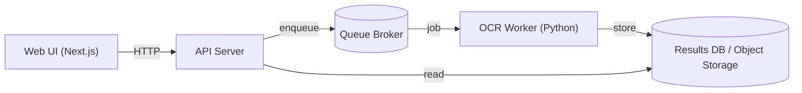

# notabypass-project

Aplikasi pipeline ringan untuk OCR dan pembersihan/normalisasi hasil teks dari gambar atau dokumen yang dipindai. Proyek ini terdiri dari sebuah worker OCR berbasis Python dan antarmuka web berbasis Next.js untuk mengirim tugas, melihat hasil, dan melakukan pembersihan teks.

**Konsep Baru**

- Memisahkan proses OCR (worker) dan antarmuka pengguna (web) agar mudah diskalakan.
- Worker menerima file gambar, mengekstrak teks menggunakan engine OCR, lalu menjalankan langkah pembersihan/normalisasi sebelum menyimpan hasil.
- Web menyediakan UI untuk mengunggah gambar, men-trigger OCR, dan menampilkan hasil beserta opsi pembersihan manual.

**Fitur utama**

- OCR worker: proses background untuk mengekstrak teks dari gambar.
- API pembersihan: endpoint untuk menjalankan pipeline pembersihan teks.
- Web UI: Next.js app untuk interaksi pengguna dan melihat hasil OCR.
- Penggunaan `docker-compose` untuk menjalankan seluruh stack secara lokal.

**Struktur proyek (ringkas)**

- [docker-compose.yml](docker-compose.yml) — pengaturan layanan untuk pengembangan/produksi ringan.
- [ocr-worker](ocr-worker/) — kode Python untuk worker OCR.
	- [ocr-worker/main.py](ocr-worker/main.py)
	- [ocr-worker/requirements.txt](ocr-worker/requirements.txt)
- [web](web/) — aplikasi frontend Next.js dan route API.
	- [web/app/api/ocr/route.ts](web/app/api/ocr/route.ts)
	- [web/app/api/clean/route.ts](web/app/api/clean/route.ts)

**Quick start (Docker)**

Jalankan seluruh layanan dengan Docker Compose:

```bash
docker-compose up --build
```

Layanan akan tersedia sesuai konfigurasi di `docker-compose.yml`.

**Pengembangan lokal (tanpa Docker)**

Web (Next.js):

```bash
cd web
npm install
npm run dev
```

OCR worker (Python):

```bash
cd ocr-worker
python -m venv .venv
source .venv/bin/activate
pip install -r requirements.txt
python main.py
```

Catatan: Sesuaikan variabel lingkungan (mis. host/port, queue broker) bila diperlukan.

**Kontribusi**

- Buat issue untuk bug atau fitur baru.
- Kirim pull request dengan deskripsi perubahan dan pengujian singkat.

**Diagram Arsitektur (Mermaid)**



**Contoh payload API**

- POST `/api/ocr` — unggah gambar untuk OCR (multipart/form-data)

Request (curl):

```bash
curl -X POST http://localhost:3000/api/ocr \
	-F "file=@/path/to/image.jpg"
```

Contoh response (201 Created):

```json
{
	"job_id": "abc123",
	"status": "queued",
	"message": "OCR job queued"
}
```

- GET `/api/ocr/{job_id}` — ambil status dan hasil jika selesai

Contoh response selesai (200 OK):

```json
{
	"job_id": "abc123",
	"status": "finished",
	"text": "Hasil OCR mentah...",
	"cleaned_text": "Hasil setelah pembersihan..."
}
```

- POST `/api/clean` — kirim teks untuk pipeline pembersihan

Request (JSON):

```json
{
	"text": "Teks yang butuh pembersihan"
}
```

Response (200 OK):

```json
{
	"cleaned_text": "Teks yang sudah dibersihkan"
}
```

**Langkah Deploy (Docker Compose & tips produksi)**

1. Jalankan lokal/pengetesan:

```bash
docker-compose up --build
```

2. Tips untuk produksi:
- Gunakan reverse proxy (nginx/traefik) untuk TLS dan routing.
- Ganti queue broker ringan dengan Redis/RabbitMQ terkelola jika perlu skalabilitas.
- Simpan hasil di object storage (S3) dan metadata di database (Postgres/Mongo).
- Jalankan worker menggunakan proses supervisor / container autoscaling.
- Jangan simpan secrets di `docker-compose.yml`; gunakan secret manager atau env vars pada runtime.


